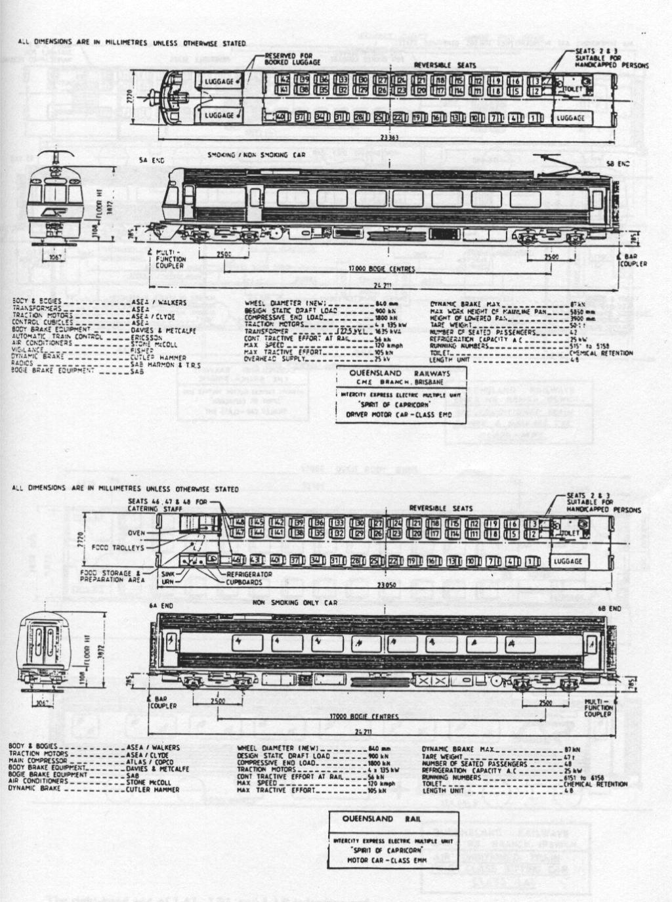
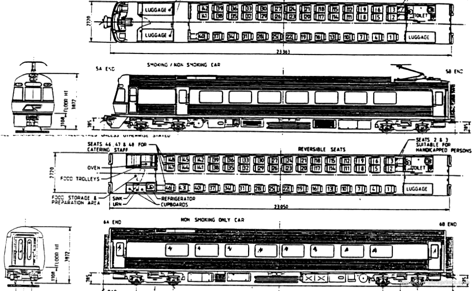
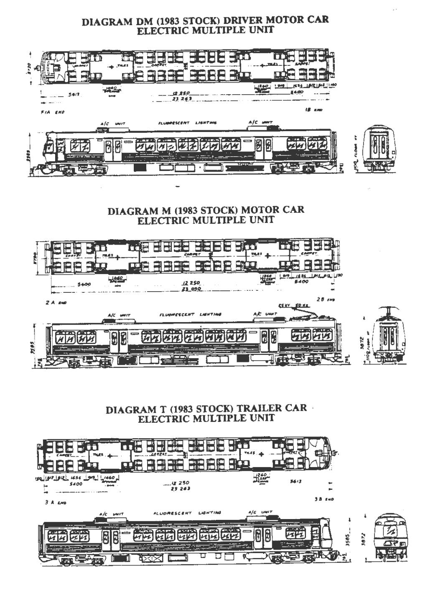
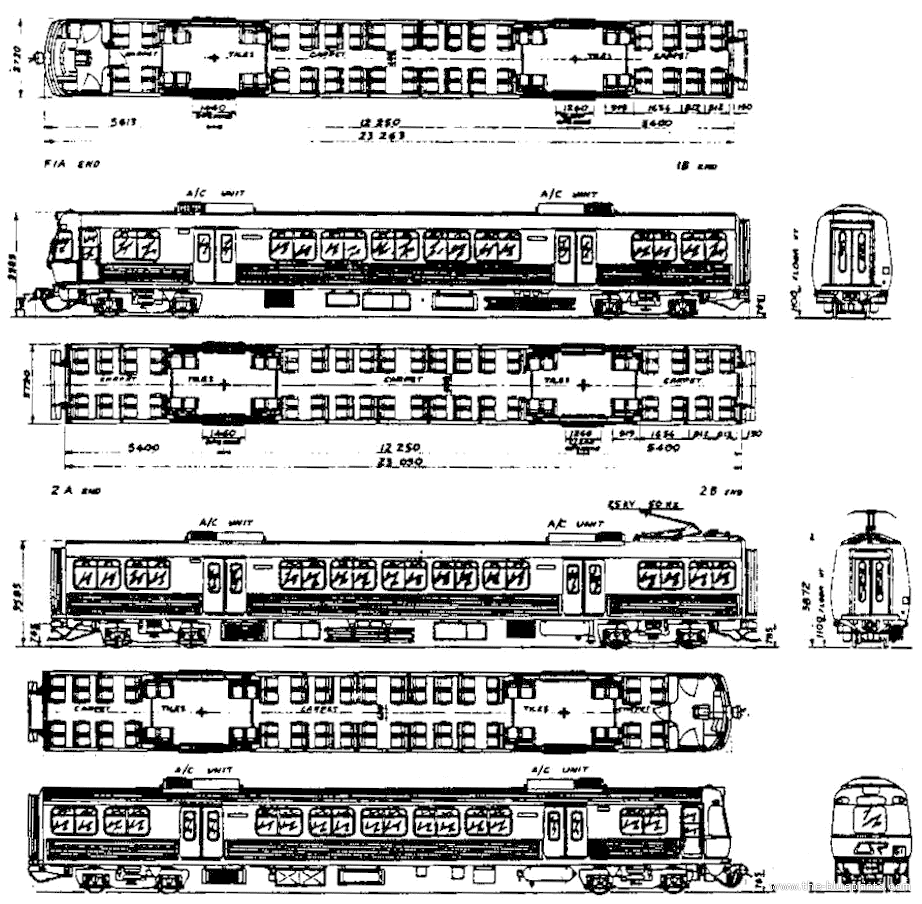
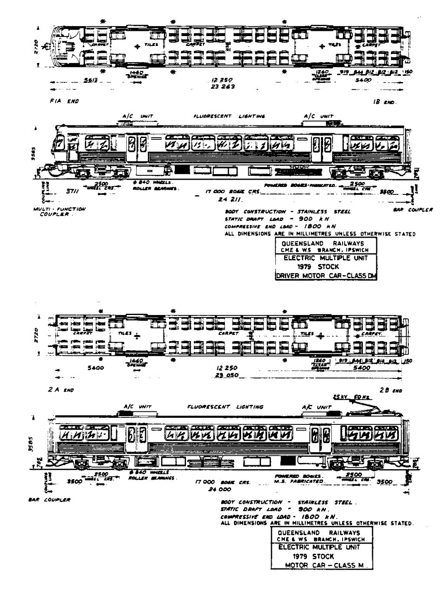
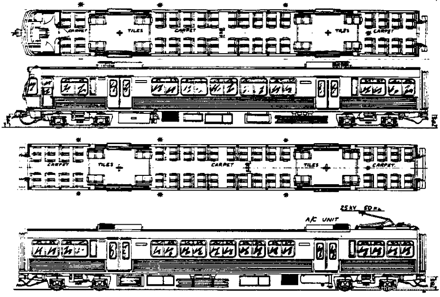
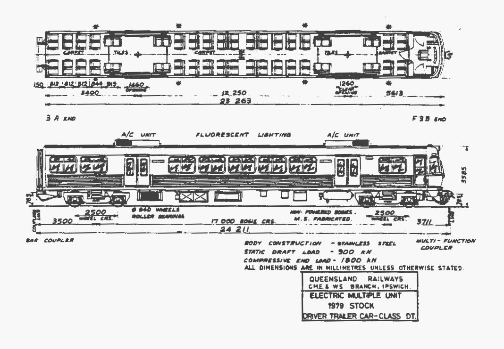
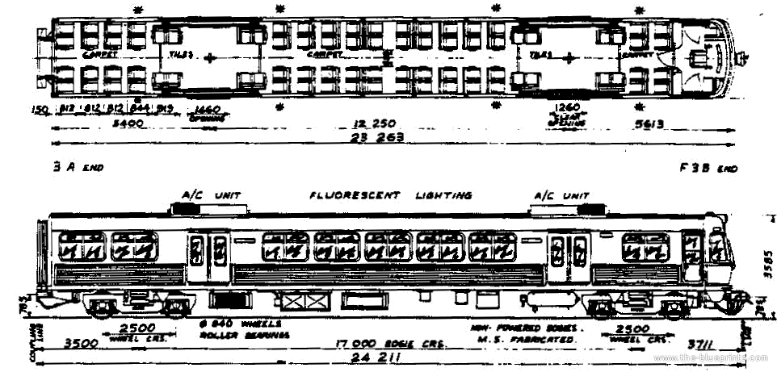

# Blueprints

Here are some blueprints of the QR trains that I found, in no particular order.

## ICE

### 1: QR ICE EMD EMM

#### Original

[View full image](../media/Blueprints/QR_ICE_EMD_EMM.jpg)

Source: [https://www.steammachine.com/prototype_archive/qr_electrics/qr_electric.html](https://www.steammachine.com/prototype_archive/qr_electrics/qr_electric.html)

#### Alternate

[View full image](../media/Blueprints/qr-ice-emd-emm.gif)

Source: [https://www.the-blueprints.com/blueprints/trains/trains-n-q/16422/view/qr_ice_emd_emm/](https://www.the-blueprints.com/blueprints/trains/trains-n-q/16422/view/qr_ice_emd_emm/)

## EMU

### 1: QR EMU DM M DT (1983)

#### Original

[View full image](../media/Blueprints/QR_EMU_DM_M_DT_1983.jpg)

Source: [https://www.steammachine.com/prototype_archive/qr_electrics/qr_electric.html](https://www.steammachine.com/prototype_archive/qr_electrics/qr_electric.html)

#### Alternate

[View full image](../media/Blueprints/qr-emu-dm-m-dt-1983.gif)

Source: [https://www.the-blueprints.com/blueprints/trains/trains-n-q/16419/view/qr_emu_dm_m_dt_1983/](https://www.the-blueprints.com/blueprints/trains/trains-n-q/16419/view/qr_emu_dm_m_dt_1983/)

### 2: QR EMU DM M (1979)

#### Original

[View full image](../media/Blueprints/QR_EMU_DM_M_1979.jpg)

Source: [https://www.steammachine.com/prototype_archive/qr_electrics/qr_electric.html](https://www.steammachine.com/prototype_archive/qr_electrics/qr_electric.html)

#### Alternate

[View full image](../media/Blueprints/qr-emu-dm-m-1979.gif)

Source: [https://www.the-blueprints.com/blueprints/trains/trains-n-q/16418/view/qr_emu_dm_m_1979/](https://www.the-blueprints.com/blueprints/trains/trains-n-q/16418/view/qr_emu_dm_m_1979/)

### 3: QR EMU DT (1979)

#### Original

[View full image](../media/Blueprints/QR_EMU_DT_1979.jpg)

Source: [https://www.steammachine.com/prototype_archive/qr_electrics/qr_electric.html](https://www.steammachine.com/prototype_archive/qr_electrics/qr_electric.html)

#### Alternate

[View full image](../media/Blueprints/qr-emu-dt-1979.gif)

Source: [https://www.the-blueprints.com/blueprints/trains/trains-n-q/16420/view/qr_emu_dt_1979/](https://www.the-blueprints.com/blueprints/trains/trains-n-q/16420/view/qr_emu_dt_1979/)
