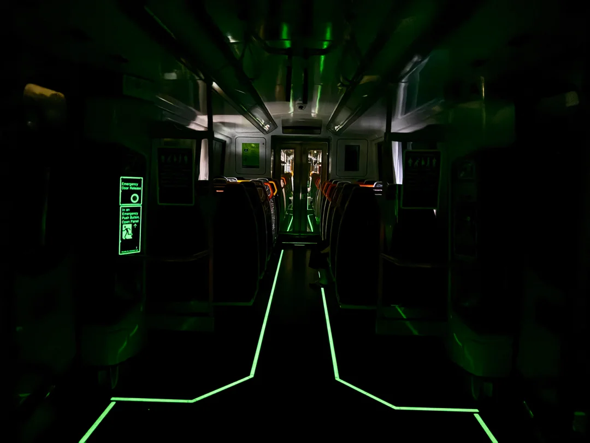
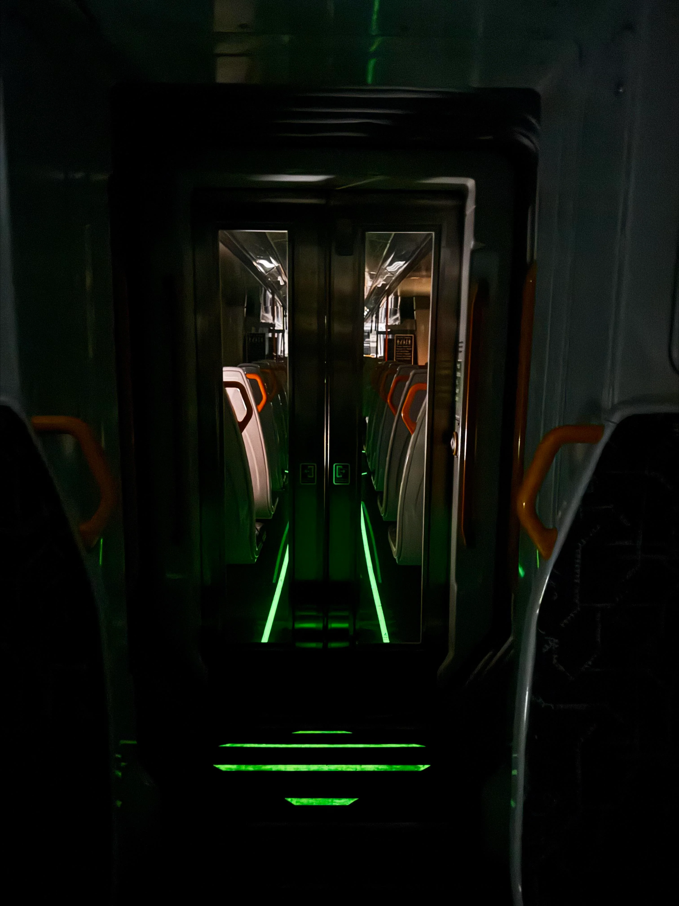
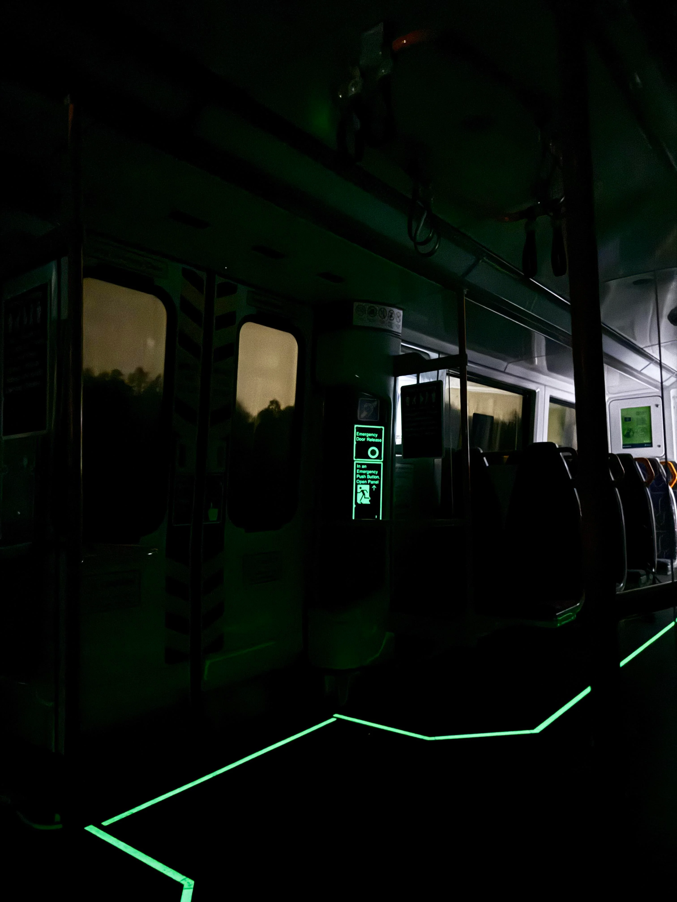
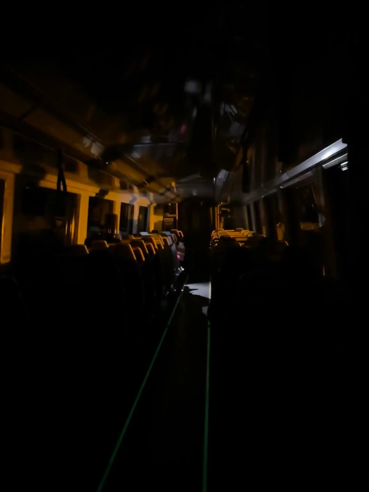
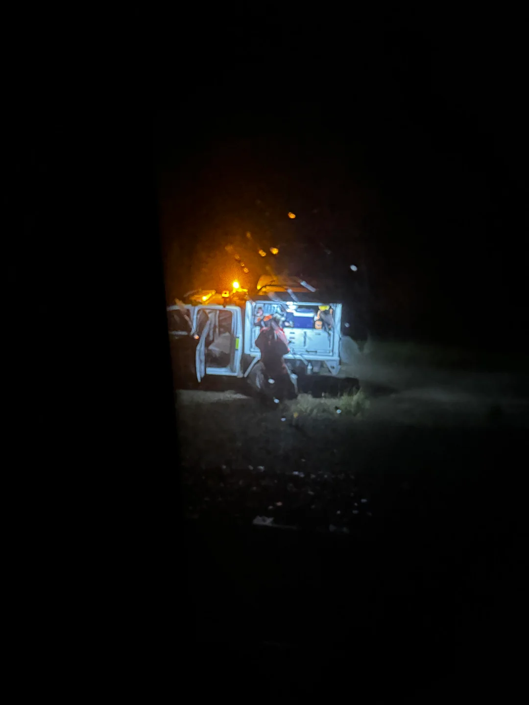
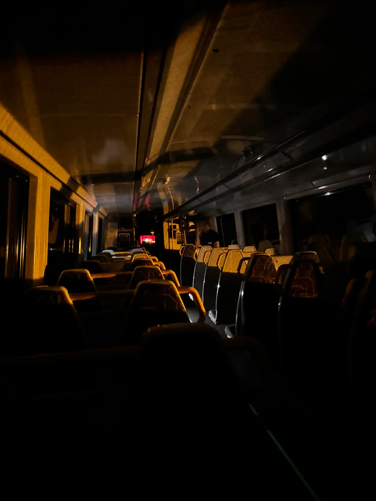
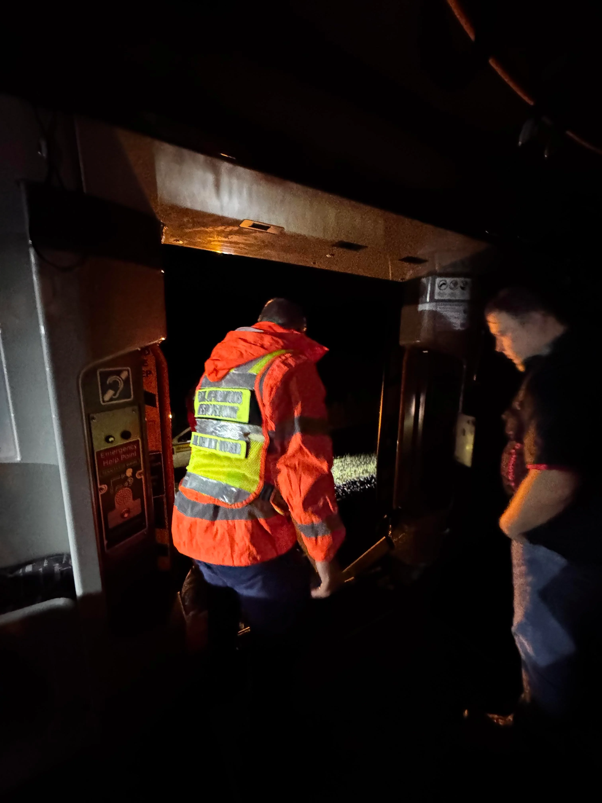
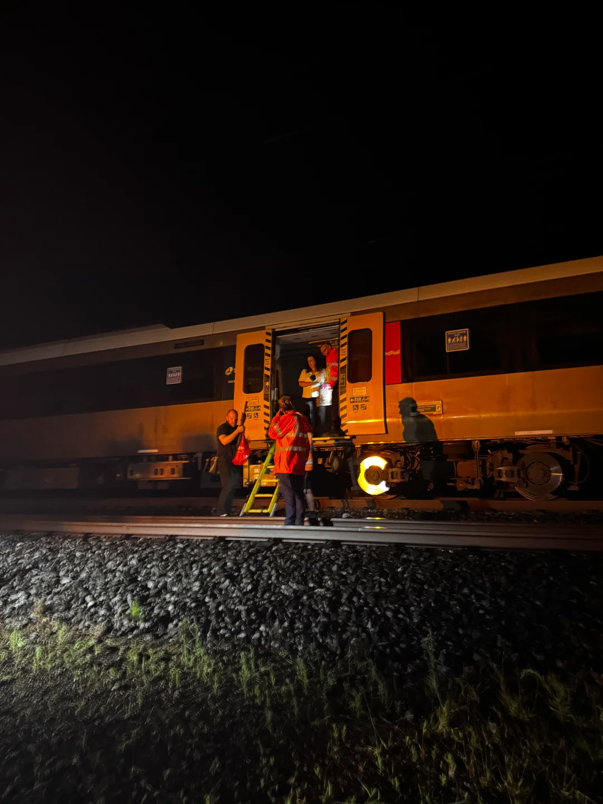
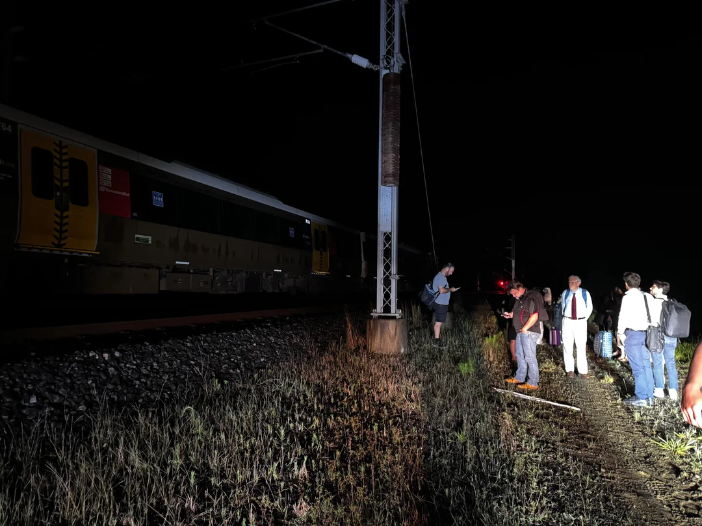
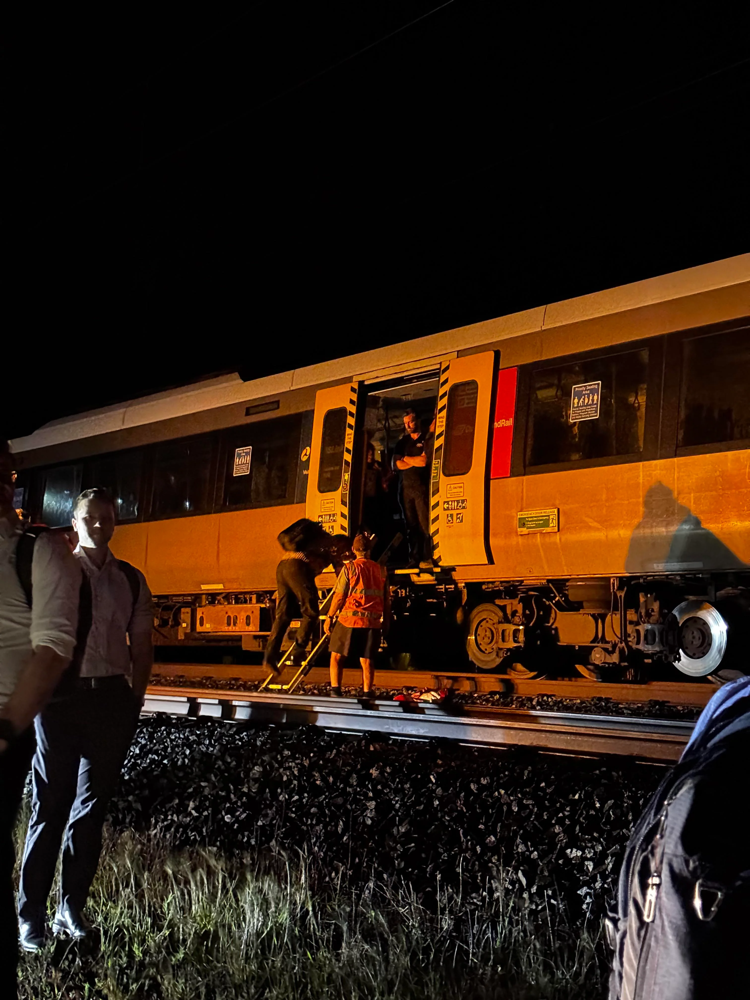

# Dark Trains

Trains can lose power for various reasons, and with the UV strip lighting on the NGRs it makes for some pretty cool photos, and pretty creepy photos on the older generation trains. Here are some photos I found of dark trains, along with their associated stories, for your viewing pleasure.

## 1: Caboolture / Nambour NGR power outages

[u/not_a_medical_doctor](https://www.reddit.com/user/not_a_medical_doctor/) on [Reddit](https://www.reddit.com/r/brisbane/comments/1gh0c38/with_the_sunshine_coast_line_still_out_i_thought/):

> Was on the Caboolture/Nambour Train last night, thought we had missed the storms.
>
> We lost mains power between Elimbah & Beerburrum. Coasted for awhile, ended up stopping maybe… 900m from Beerburrum station - a super terrible spot for mobile phone coverage.
>
> Announcement came on that we had lost it, investigating. About 10 minutes later that the time to inspection was at least 55 minutes, which exceeds the Trains battery.
>
> So we got to be in the dark, with no AC. People handled it pretty well. I’ve never done a train evacuation before.
>
> After we all bailed out, we trundled up the tracks to Beerburrum Station.

## 2: SMU260 @ Midnight

[u/akkobutnotreally](https://www.reddit.com/user/akkobutnotreally/) on [Reddit](https://www.reddit.com/r/brisbane/comments/11lmi2d/comment/jbe84wn/):

> Alright, I got everyone hooked with the photo. Now you'll have to read the story behind it.
> It was late. I was at Robina waiting for something to get me to Helensvale. My girlfriend was waiting for me there.
>
> The train arrives on time at 11:42pm: a pair of SMU260s. "Weird", I thought: the Gold Coast line is mostly served by NGRs but it didn't matter at that point. We departed on time as well.
>
> The lights on the last carriage were already turned off. I asked the guard about it and he told me that they were planning to uncouple the rear unit at Beenleigh. He was just making preparations beforehand, and then he asked me where I was headed to.
>
> "Helensvale", I said.
>
> He said I could stay in the dark carriage for the moment if I wanted to, so I went and picked a front-facing seat. It was pitch black. Mostly silent: just the sound of the motors going at speed.
>
> I've always liked trains, but back in my home country it's always a shitshow to be on one. Between the morons playing music with pretty much an entire band, fuckwits selling you shit or idiots asking you for money, as well as the employees just not giving a fuck and taking bribes to look the other way. It's never a pleasant experience. It's futile for me.
>
> I started to cry. I've been living here for just a few months and I just couldn't believe it. I feel safe here. I can enjoy my time on the rails here, just zoning out and actually smiling for once, or sometimes exchanging a quick chat with the QR employees which always seem to be kind enough to talk with this idiot.
>
> We arrived at Helensvale. I said thanks to the guard and went to my girlfriend's car.
>
> Thanks to everyone for being so friendly. It means a lot to me.

