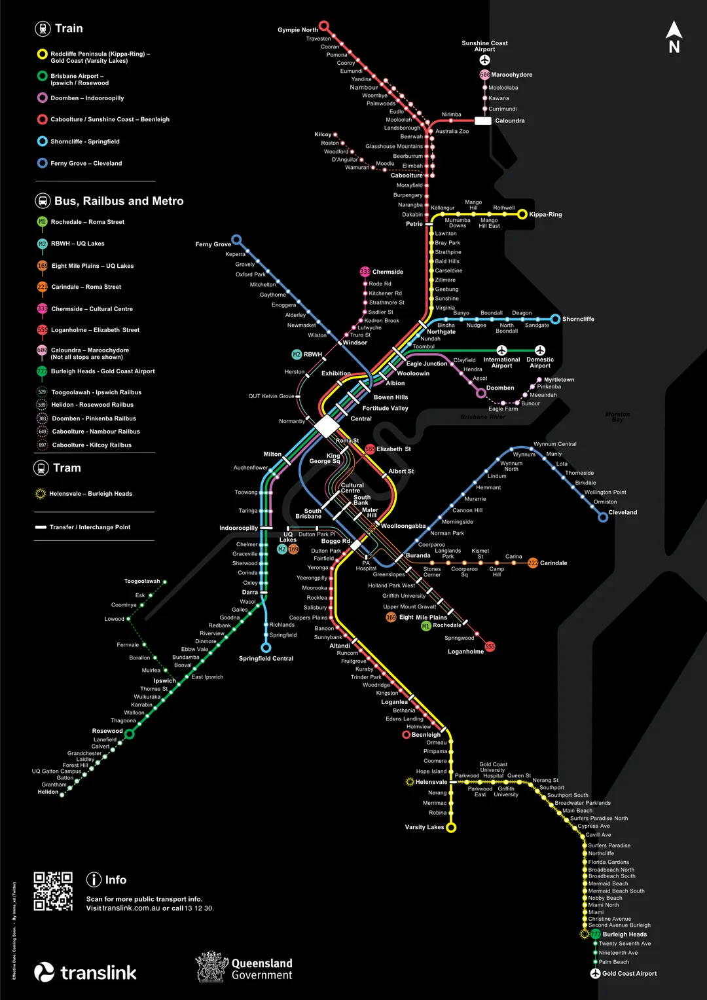

# Cool Maps

Here are some cool maps of the SEQ / QLD / AUS rail network that I found. And some other ones too.

## 2024 Translink Map w/ CRR and Railbus

I think it has the new CRR line pairings, but I'm not really sure what they're going to be.

> Sourced from [https://www.reddit.com/r/BrisbaneTrains/comments/1hrlj4d/translink_crr_map_with_railbus_lines/](https://www.reddit.com/r/BrisbaneTrains/comments/1hrlj4d/translink_crr_map_with_railbus_lines/)

## RailMaps

RailMaps ([https://railmaps.com.au/](https://railmaps.com.au/)) has some cool maps of Australian rail networks.

- [Brisbane Area](../media/RailMaps-Brisbane.pdf) [(Source)](https://railmaps.com.au/brisbane.htm)
- [Queensland](https://railmaps.com.au/queensland.htm)
- [Australia (Overview)](../media/RailMaps-Australia.pdf) [(Source)](https://railmaps.com.au/index.html)
- [Australia (Every Station)](../media/RailMaps-Australia_Every_Station.pdf) [(Source)](https://railmaps.com.au/National_Rail_Map.htm)