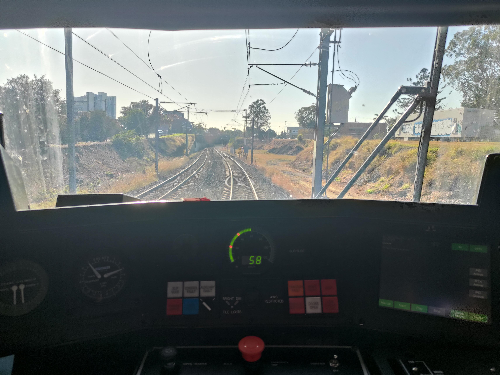

# EMU (Walkers/Adtranz Electric Multiple Unit)

EMUs are objectively the best of all the train types on the QR SEQ network (in my opinion).

Back in the 1970s, QR stared electrifying Brisbane's suburban railways. The first section completed was between Ferny Grove and Darra and naturally, QR needed some new electric trains to run along the electrified route.

QR ordered a batch of modern air-conditioned commuter trains from Walkers/ASEA at Maryborough. The EMUs are composed of three cars permanently coupled and are capable of seating up to 248 passengers, however they are often operated with two sets coupled together to form a six-car set. The 88 suburban units weigh approx. 150 tonnes, are 72.4m over couplers, have a maximum service speed of 100km/h (62.5mph) and an emergency stopping distance from that speed of only 415 metres.

Individual car seating capacity:

- 80 (DM101–88: driving motor car, DT301–59, DT380–8: driving trailer car, T460–79: trailer car)
- 88 (M201–88: motor car)

Sets 01–13 have a smooth roof, while Sets 14–88, which were built from 1983 to 1986, have a corrugated roof. Most sets consist of a driving motor car, motor car and a driving trailer car. Sets 60–79 consist of a driving motor car, motor car and a trailer car, and thus have a driver’s cab at only one end, so operate with two sets combined to form a six-carriage train.

All cars are air-conditioned with air operated doors, which can be opened by passengers and are closed by drivers. A public address system, UHF crew to crew radio and crew intercommunication systems are fitted. Guards sometimes make passenger announcements when the automatic announcements aren’t working.

## Timeline

- _July 1979 - December 1986_: EMU units delivered.
- _1984_: 48 units, which were purchased for the price of $44.26 million were sold and leased back.
- _September 1986_: Units 84, 85, 86 and 88 were hauled to Gladstone to operate a VIP train to Rockhampton in connection with the completion of an electrification project, before operating some special services to Bajool and Mount Larcom.
- _29 April 1988_: Units 81–88 operated Sunshine Coast line services from Caboolture to Nambour pending the delivery of the InterCity Express fleet after being fitted with VHF radios. Others appeared on Sunshine Coast services with hand held radios.
- _September 1988_: InterCity Express units delivered, EMUs operated in multiple with them for a period.
- _August 1990_: Units 84 and 68 ran through to Gympie North temporarily.
- _Late 1993_: EMUs fitted with yellow cab ends for higher visibility.
- _1996_: Some EMUs appeared on Gold Coast line services, although they were only used sparingly, not being geared to operate at the 140km/h line speed.
- _1998-2000_: The cab windows were modified on EMU60-88 for better visibility and also the fitting of a rear view mirror and security cameras inside.
- _2000_: The first series EMUs (01-19) were upgraded with high visibility cab ends which incorporated a fender (which incorporates an anti-climber to precent outriders hanging off the back of a unit) with ditch lights and a new colour scheme with a black band across the windscreen (hence the nickname of these units, ‘Bandicoots’).
- _May 2001_: EMU62 was severely damaged after an Arson attack at Mayne.
- _21 September 2001_: EMU05 and EMU60 were both written off in the Cattletrain derailment at Petrie in September. EMU62 was returned to service, while one 3-car unit was salvaged out of both EMU05 and EMU60 to form EMU60, including EM305 replacing EM160, EM260, and EM360.
- _2018_: Withdrawls begin of the EMUs as NGRs were delivered.
- _January 2019_: 30 EMUs in store.
- _August 2019_: Queensland Rail operated a farewell tour with units 01 and 04 over two days covering all Brisbane suburban lines including a reenactment of the first electric train service in Brisbane from Ferny Grove to Darra. Both units were removed from service and taken to Ipswich Workshops for static preservation.
- _2020_: EMU60 scrapped.

## Fleet Status

| Year ordered | Number built | Fleet numbers | Notes                                                                         |
| ------------ | ------------ | ------------- | ----------------------------------------------------------------------------- |
| 1977         | 13           | 01–13         | All withdrawn and scrapped, excluding 01 and 04, which are stored at Ipswich. |
| 1979         | 11           | 14–24         | All withdrawn.                                                                |
| 1980         | 16           | 25–40         | Units 30–38, 42 and 48 have been withdrawn.                                   |
| 1980         | 20           | 60–79         | Single cab units, 60 originally numbered 80. All scrapped.                    |
| 1983         | 16           | 41–56         | Units 52 and 54 have been withdrawn.                                          |
| 1984         | 8            | 81–88         |                                                                               |
| 1985         | 4            | 57–59, 80     | Units 58 and 80 have been withdrawn.                                          |

## Gallery

> EMU53 at Darra Station, Platform 1, operating BRIP (Brisbane City - Ipswich) service. Run 1554. Taken 28/12/24 @ 18:59. [View png](../media/EMU53_Darra_preview.png).

> The cab of an EMU maybe??. Source: [https://www.reddit.com/r/BrisbaneTrains/comments/1658g65/was_a_great_day_to_play_trains](https://www.reddit.com/r/BrisbaneTrains/comments/1658g65/was_a_great_day_to_play_trains/)

<iframe width="560" height="315" src="https://www.youtube-nocookie.com/embed/nngiPQ2tajY?si=FRzmHGJxyaErzLrH" title="YouTube video player" frameborder="0" allow="accelerometer; autoplay; clipboard-write; encrypted-media; gyroscope; picture-in-picture; web-share" referrerpolicy="strict-origin-when-cross-origin" allowfullscreen></iframe>
> Another video of the inside of an EMU, this time EM336. Source: [https://www.youtube.com/watch?v=nngiPQ2tajY](https://www.youtube.com/watch?v=nngiPQ2tajY). [Archived](../media/EMU_cab.mp4).

## Sources

- [https://qrig.org/motive-power/self-propelled-passenger-stock/electric-multiple-units/walkersadtranz-electric-multiple-unit-emu](https://qrig.org/motive-power/self-propelled-passenger-stock/electric-multiple-units/walkersadtranz-electric-multiple-unit-emu)
- [https://www.railtram.com.au/emu-electric-multiple-unit](https://www.railtram.com.au/emu-electric-multiple-unit)
- [https://en.wikipedia.org/wiki/Electric_multiple_unit_(Queensland_Rail)](https://en.wikipedia.org/wiki/Electric_multiple_unit_(Queensland_Rail))