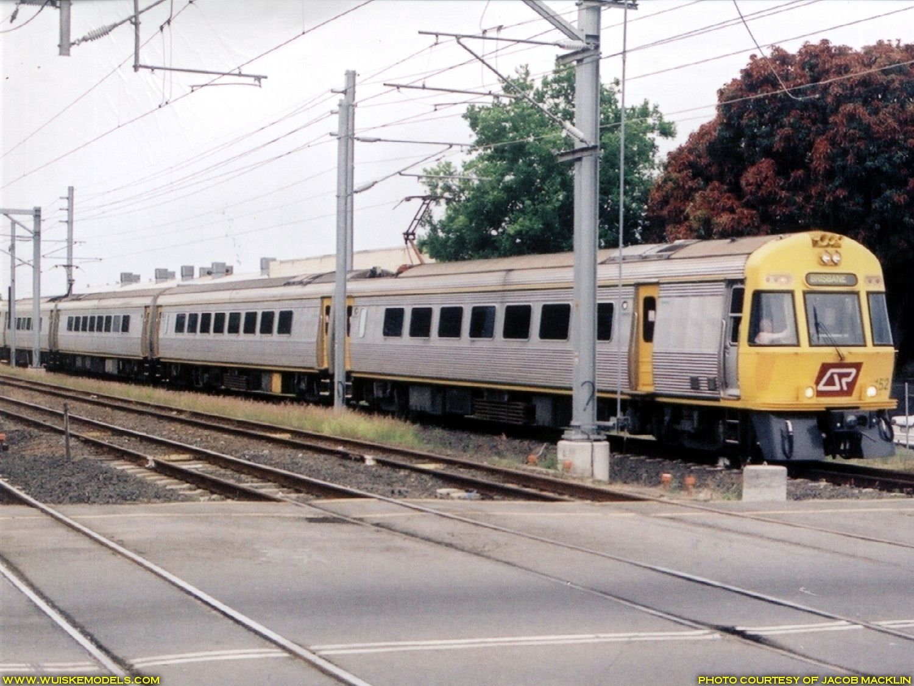
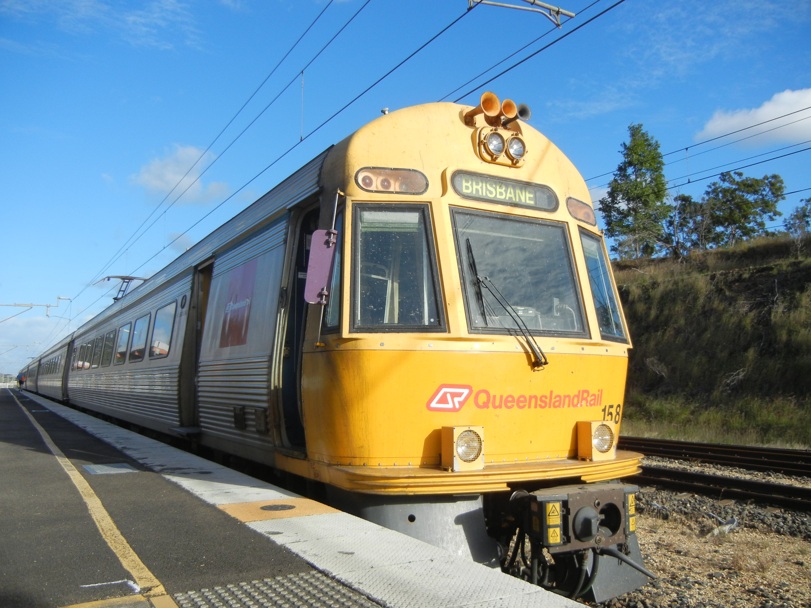
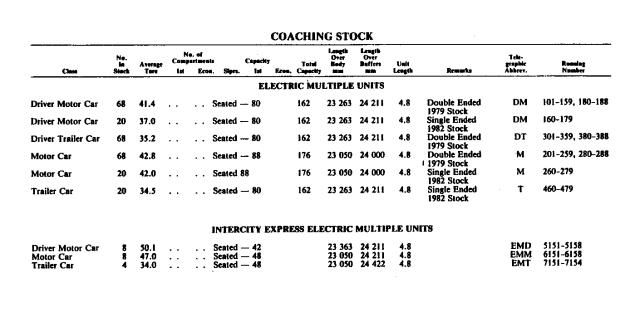
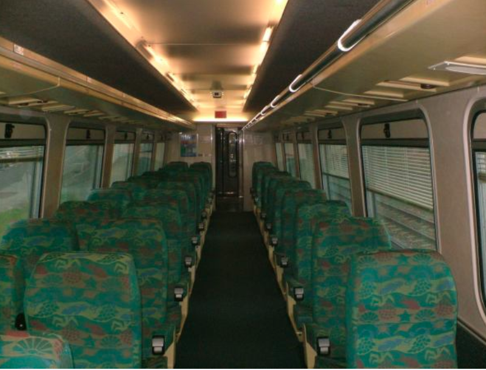
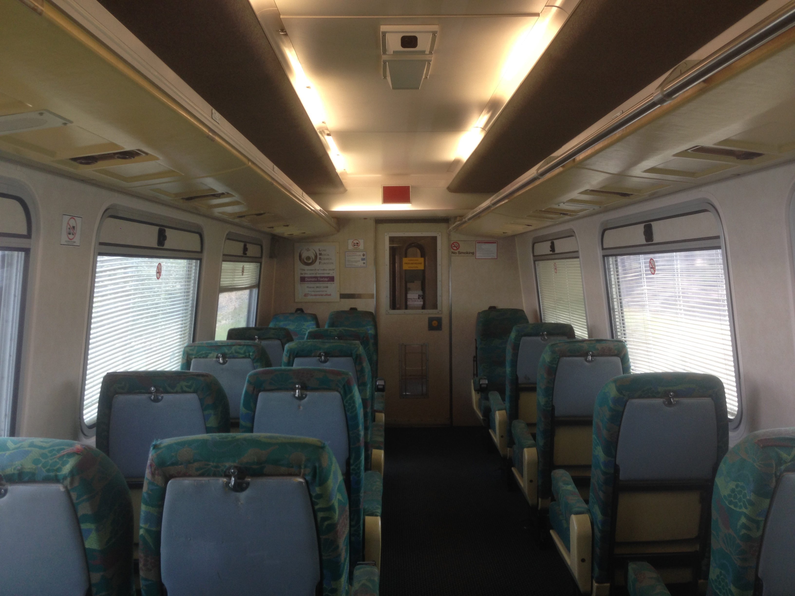
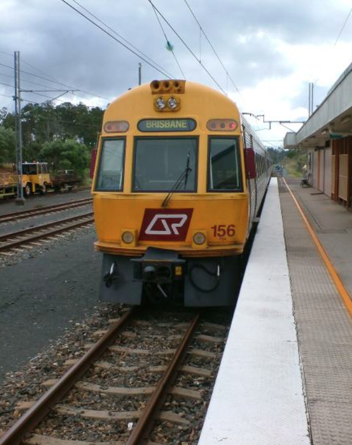
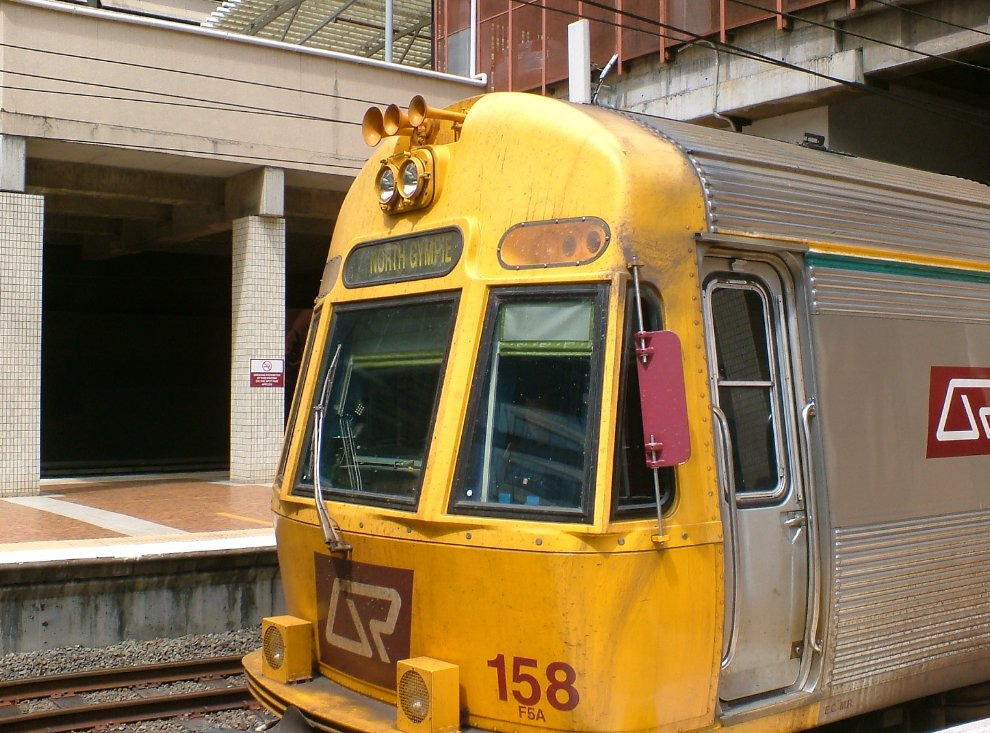
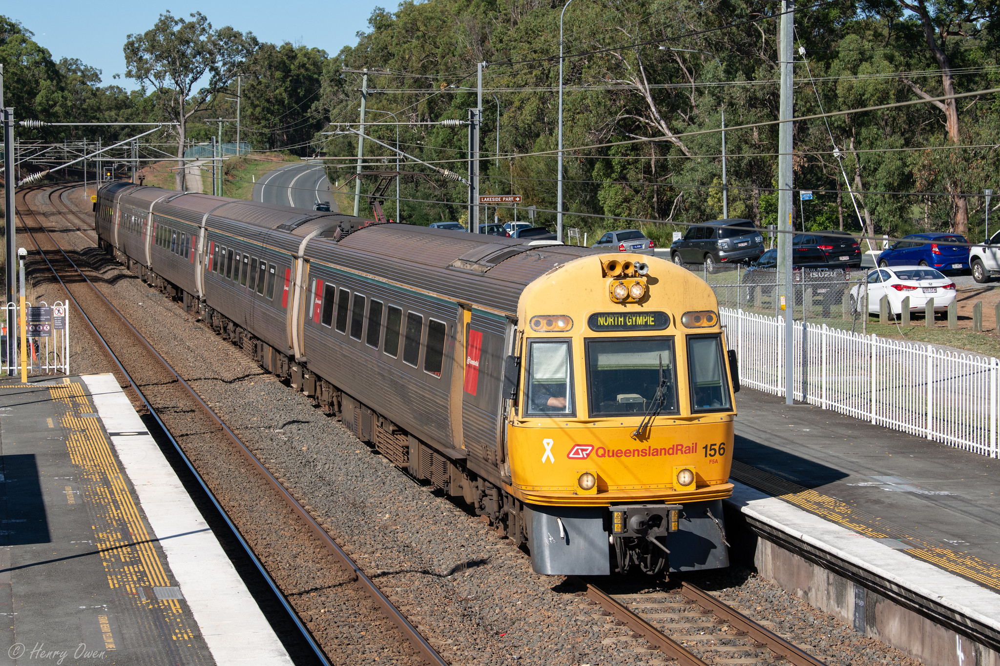
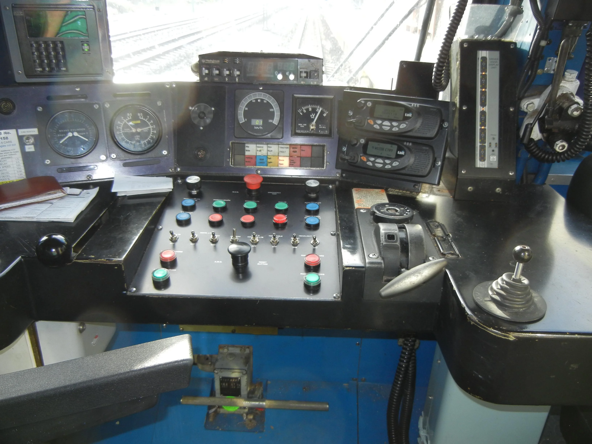
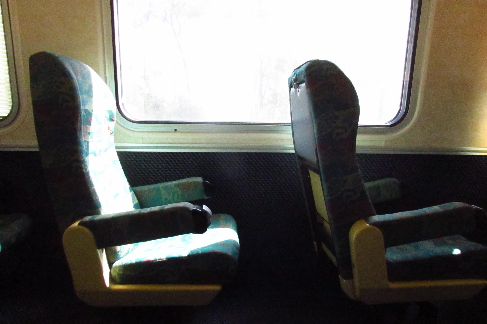

# ICE (Walkers/Adtranz InterCity Express)

The InterCity Express (ICE) sets were introduced in 1988 by QR, for use on the North Coast line _Spirit of Capricorn_ service, from Brisbane to Rockhampton (approx. 640km)\[1,2\]. When they were first introduced, they cut the journey time by five hours\[1\]. As of November 2021, all units have been retired from service\[2\].

In 1987, in order to operate the _Spirit of Capricorn_ line between Brisbane and Rockhampton, QR ordered 16 electric multiple carriages from Walkers, with the stainless steel design based on the EMUs operating suburban services at the time\[1,2\]. They were to be eight semi-permanently coupled pairs of a driving motor car (EMD) and a non-driving motor car (EMM) that were planned to operate as four-carriage sets\[2\]. ABB supplied the electrical equipment and the company's local partner, Walkers, manufactured the mechanical parts, partly to ABB's design\[1\]. In 1988 an additional four trailer cars (EMT) were ordered to allow the sets to be built up to five or six carriages\[2\].

The trains can be run in 4 or 6 car configuration, with two power pairs accompanied by either one or two trailer cars. A power pair consists of two power cars with ABB thyristor drive equipment, one of which has the driver's cab. They also used to multiple to EMUs forming a Hybrid unit (ICE Power pair + 3 car EMU), and would usually only do this for Gympie North services\[1\]. In November 1990 an eight car set was operated\[2\].

The first trials were conducted in May 1988, before the first entered service on Sunshine Coast line services from Brisbane to Nambour, operating in multiple with Electric Multiple Units. On 5 February 1989, they began to operate through to Gympie North. On 3 July 1989, they began to operate Spirit of Capricorn services to Rockhampton\[2\].

They were displaced from their intended use by the faster Electric Tilt Train in 1998, and the ICE was surplus to the requirements on the Central Queensland services. The Spirit of Capricorn service was ran for the last time on the 24th of May 2003. After that they could be found doing Caboolture-Nambour shuttles, as well as Cooroy and Gympie North services\[1\]. They briefly operated on the Gold Coast line following its extension to Nerang in May 1998 and Robina in November 1998, and were also used on the Corinda-Yeerongpilly line from January 2000 after the withdrawal of the Queensland Railways 2000 class rail motor\[2\].

In 2001, all were fitted with power operated equipment to close the doors\[2\].

During 2003 and 2004, the ICE units were refurbished to upgrade the units to the current standards, including visibility lights, yellow saloon doors, upgraded toilets, and doors. The refurbishment program was undertaken by Walkers/EDI at Maryborough, where they were manufactured\[1\].

In 2005, the ICE power pairs again headed to Maryborough to receive angled window frames to replace the curved side windows\[1\].

> ICE152 heading to Brisbane. By Jacob Macklin. It can be seen with curved windows. [Source](https://www.wuiskemodels.com/prototype/index.php?sfpg=MDA2LS1MT05HIERJU1RBTkNFIFBBU1NFTkdFUiBTRVRTL0lDRS8qSUNFXzE1Ml8wMDQuanBnKlBBR0UqaW1hZ2Vmb3JtKioxYjY1YTY3YWMwMWRhODQyYTI4MGM3YWU2NmZkZjQzOA). [See full image](../media/ICE_5.jpg)

> QR's ICE Unit 158 at Gympie North Railway Station. It can be seen with more angular windows. <a href="https://commons.wikimedia.org/wiki/File:ICE_158.jpg">Bearq07</a>, <a href="https://creativecommons.org/licenses/by-sa/4.0">CC BY-SA 4.0</a>, via Wikimedia Commons. [Source](https://commons.wikimedia.org/wiki/File:ICE_158.jpg). [See full image](../media/ICE_6.jpg)

Driving motor cars 5155 and 5156 were named City of Brisbane and City of Rockhampton to mark the commencement of the Spirit of Capricorn service in July 1989\[2\].

Like all other passenger trains operating within the Brisbane Suburban Area, ICEs are fitted with AWS (Audible Warning System). When there is an upcoming restrictive signal (any signal other than green), the driver must acknowledge the warning provided for it within three seconds of its receipt by pressing a button on trains' control panels. If the approaching signal is green, no acknowledgment by the driver is required. Should a train proceed past a restrictive signal without the driver having first acknowledged the warning, the train’s emergency brakes are automatically applied to stop the train. For AWS to operate, both track and rollingstock must be equipped\[3\].

SMUs, along with IMUs, EMUs, and probably NGRs, are also fitted with door sensors and traction interlocks. The sensors trigger the doors to open if they detect an obstruction upon closing, much like an elevator door. Traction interlocks block power to the trains’ drive motors until all doors have fully closed preventing trains from moving with doors open or obstructed\[3\].

SMUs, IMUs and ICEs were supplied with rigid steel skirts that protect the wheels and undercarriage equipment. These skirts extend to within approximately 50 mm of the rails, and provide a measure of protection from damage caused by collisions with obstructions at track level\[3\].

## Technical Details

| Name                                                                                          | Value                                                    |
| --------------------------------------------------------------------------------------------- | -------------------------------------------------------- |
| Unit Numbers\[1\]                                                                  | EMD 5151-5158  EMM 6151-6159  EMT 7151-7154        |
| Introduced\[1\]                                                                    | 1988                                                     |
| Builder\[1\]                                                                       | Walkers Ltd. Maryborough/ABB Switzerland                 |
| Number built\[2\]                                                                  | 20 carriages                                             |
| Gauge\[1\]                                                                         | Narrow Gauge (1,067mm or 3' 6")                          |
| Cars per Train\[1\]                                                                | 4-6                                                      |
| Unit Length\[1\] - 4 car - 5 car - 6 car                                  | 95.6m 120m 144.4m                                  |
| Car Body Length\[1\] - Driving Motor - Motor - Trailer                    | 23,400mm 23,100mm 23,100mm                         |
| Car Designations\[1\] - Driver Motor Car - Motor Car - Driver Trailer Car | EMD EMM EMT                                        |
| Width\[1\]                                                                         | 2,720mm                                                  |
| Bogie Centres\[1\]                                                                 | 17,000m                                                  |
| Wheel Diameter\[1\]                                                                | 840mm                                                    |
| Height over Roofline\[1\]                                                          | 3,900mm                                                  |
| Speed\[1\]                                                                         | Operating - 120km/h (62.5mph), Design - 160km/h (100mph) |
| Traction System\[2\]                                                               | ABB thyristor–phase-fired controller                     |
| Traction Rating\[1\]                                                               | 1080kW (8x135kW)                                         |
| UIC Classification\[2\]                                                            | Bo′Bo′+Bo′Bo′(+2′2′(+2′2′))+Bo′Bo′+Bo′Bo′                |
| Tare Weight\[1\]- Power Pair - Trailer Car                                      | 98.2t 35.0t                                           |
| Seating Capacity\[1\]- 4 car - 5 car - 6 car                                 | 180 228 276                                        |
| Traction Motor Control\[1\]                                                        | Phase angle thyristor control, Separately Excited DC     |
| Brake System\[1\]                                                                  | Rheostatic brake blended with EP thread brake            |
| Suspension\[1\]                                                                    | Primary - Rubber Chevron Secondary - Air              |
| Auxiliary System\[1\]                                                              | 2x 135kVA, 415V, 50Hz                                    |

## Gallery

There may also be other photos in the [Gallery](../Gallery/Photos.md). See also: [Wuiske Models ICE Prototype Photos](https://www.wuiskemodels.com/prototype/index.php?sfpg=MDA2LS1MT05HIERJU1RBTkNFIFBBU1NFTkdFUiBTRVRTL0lDRS8qKioqKjQ3YWE5MWM0YzMwMzc0MWVlMzY1Njc1NzAwNmViZWQ1)

[View full image](../media/QR_EMU_ICE_Details.jpg)

> Details of the EMU and ICE fleet

 <iframe title="Queensland Rail ICE (InterCity Express) Train" frameborder="0" allowfullscreen mozallowfullscreen="true" webkitallowfullscreen="true" allow="autoplay; fullscreen; xr-spatial-tracking" xr-spatial-tracking execution-while-out-of-viewport execution-while-not-rendered web-share width="640" height="480" src="https://sketchfab.com/models/7cac661c6a9940bb86aeae1c79f6fc8d/embed?dnt=1"> </iframe> 
 <a href="https://sketchfab.com/3d-models/queensland-rail-ice-intercity-express-train-7cac661c6a9940bb86aeae1c79f6fc8d?utm_medium=embed&utm_campaign=share-popup&utm_content=7cac661c6a9940bb86aeae1c79f6fc8d" target="_blank" rel="nofollow" style="font-weight: bold; color: #1CAAD9;"> Queensland Rail ICE (InterCity Express) Train </a> by <a href="https://sketchfab.com/Jotrain?utm_medium=embed&utm_campaign=share-popup&utm_content=7cac661c6a9940bb86aeae1c79f6fc8d" target="_blank" rel="nofollow" style="font-weight: bold; color: #1CAAD9;"> Jotrain Models </a> on <a href="https://sketchfab.com?utm_medium=embed&utm_campaign=share-popup&utm_content=7cac661c6a9940bb86aeae1c79f6fc8d" target="_blank" rel="nofollow" style="font-weight: bold; color: #1CAAD9;">Sketchfab</a>

> A 3D model of ICE154/156 on [Sketchfab](https://sketchfab.com/3d-models/queensland-rail-ice-intercity-express-train-7cac661c6a9940bb86aeae1c79f6fc8d). Switch to First Person view for a better navigation experience.

> The interior of ICE 158. [OzBob on Twitter](https://x.com/ozbob13/status/1249080174718513152/photo/1)

> Interior of an InterCity Express train, March 2011.
> <a href="https://commons.wikimedia.org/wiki/File:Queensland_Rail_ICE_carriage_interior_Sunshine_Coast_ICE_train_interior_P1110429.jpg">John Robert McPherson</a>, <a href="https://creativecommons.org/licenses/by-sa/4.0">CC BY-SA 4.0</a>, via Wikimedia Commons

> Interior of an InterCity Express train, October 2017.
> By <a href="//commons.wikimedia.org/wiki/User:4TheWynne" title="User:4TheWynne">4TheWynne</a> - Own work, <a href="https://creativecommons.org/licenses/by-sa/4.0" title="Creative Commons Attribution-Share Alike 4.0">CC BY-SA 4.0</a>, <a href="https://commons.wikimedia.org/w/index.php?curid=63267860">Link</a>

> ICE156 at Gympie North, headed towards Brisbane.
> [OzBob on Twitter](https://x.com/ozbob13/status/1249082168665460736/photo/2)

> ICE158 at Brisbane, headed towards Gympie North.
> [OzBob on Twitter](https://x.com/ozbob13/status/1249079603357835265/photo/2)

> ICE156 at Dakabin. Lead by EMD5156. Run X401. Taken Wednesday 29th May 2019. From [https://flic.kr/p/2g8Bdsq](https://flic.kr/p/2g8Bdsq)

> ICE158 prior to it's retirement. [u/Rando-Random](https://www.reddit.com/user/Rando-Random/) on [Reddit](https://www.reddit.com/r/trains/comments/pcjbj7/queensland_rail_ice_unit_158_prior_to_retirement/). [See full image](../media/ICE_4.webp)

> The cab of ICE158 prior to it's retirement. [u/Rando-Random](https://www.reddit.com/user/Rando-Random/) on [Reddit](https://www.reddit.com/r/trains/comments/pcjbj7/queensland_rail_ice_unit_158_prior_to_retirement/). [See full image](../media/ICE_Cab_1.webp)

> The interior of ICE158 prior to it's retirement, showcasing the 1-aisle seating. Seats are in 1:2 Configuration each with tray tables and Reclining seats. [u/Rando-Random](https://www.reddit.com/user/Rando-Random/) on [Reddit](https://www.reddit.com/r/trains/comments/pcjbj7/queensland_rail_ice_unit_158_prior_to_retirement/). [See full image](../media/ICE_Interior_4.webp)

> ICE152 heading to Brisbane. By Jacob Macklin. It can be seen with curved windows. [Source](https://www.wuiskemodels.com/prototype/index.php?sfpg=MDA2LS1MT05HIERJU1RBTkNFIFBBU1NFTkdFUiBTRVRTL0lDRS8qSUNFXzE1Ml8wMDQuanBnKlBBR0UqaW1hZ2Vmb3JtKioxYjY1YTY3YWMwMWRhODQyYTI4MGM3YWU2NmZkZjQzOA). [See full image](../media/ICE_5.jpg)

> QR's ICE Unit 158 at Gympie North Railway Station. <a href="https://commons.wikimedia.org/wiki/File:ICE_158.jpg">Bearq07</a>, <a href="https://creativecommons.org/licenses/by-sa/4.0">CC BY-SA 4.0</a>, via Wikimedia Commons. [Source](https://commons.wikimedia.org/wiki/File:ICE_158.jpg). [See full image](../media/ICE_6.jpg)

## Sources

- **\[1\]** [https://qrig.org/motive-power/self-propelled-passenger-stock/electric-multiple-units/walkersadtranz-intercity-express-ice](https://qrig.org/motive-power/self-propelled-passenger-stock/electric-multiple-units/walkersadtranz-intercity-express-ice)
- **\[2\]** [https://en.wikipedia.org/wiki/InterCity_Express\_(Queensland_Rail)](<https://en.wikipedia.org/wiki/InterCity_Express_(Queensland_Rail)>)
- **\[3\]** [https://documents.parliament.qld.gov.au/committees/TSAFE/pre1999/tsafe23.pdf](https://documents.parliament.qld.gov.au/committees/TSAFE/pre1999/tsafe23.pdf)