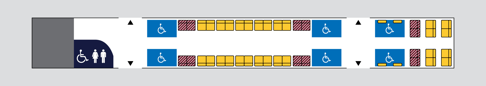

# IMU (Interurban Multiple Unit)

The IMUs were introduced to provide new rollingstock for the Gold Coast line in 1996. The IMUs are a long-distance optimised version of the SMUs, with extra features such as larger seats, luggage racks, toilets. On the exterior, they are similar enough that Queensland Rail uses identical photos for them on their "[Carriage Layouts](https://www.queenslandrail.com.au/forcustomers/accessibility/carriage-layouts)" section. Another difference is the IMU100 and 120's higher top speeds than their SMU counterparts. I think it is due to a better cooling system for one of the parts, but I can't seem to find the place where I read it again. They also have a higher gear ratio of 1:4.367 vs 1:5.169 on the SMUs.

## EDI/Bombardier Interurban Multiple Unit 100 series (IMU100)

> The IMU100 as seen on [QR's _Carriage Layouts_ page](https://www.queenslandrail.com.au/forcustomers/accessibility/carriage-layouts)

### Carriage Layout

#### Carriage 1

#### Carriage 2

#### Carriage 3

## EDI/Bombardier Interurban Multiple Unit 120 series (IMU120)

> The IMU120 as seen on [QR's _Carriage Layouts_ page](https://www.queenslandrail.com.au/forcustomers/accessibility/carriage-layouts)

### Quirks

To keep the auxiliary converters (and systems) online through neutral sections 220’s and 120’s automatically apply a small amount of regenerative braking when traversing neutral sections at speeds above 20km/h. This reduces the need to rely on the battery system and is why they maintain full lighting and air conditioning compared to other units in the fleet.

For some reason at speeds around 40-60km/h they can produce a rather nasty shudder through the train. As a driver there isn’t much that can be done to prevent it. Some do it, some don’t, some are worse than others. Just a quirk of the units.
Source: [https://www.reddit.com/r/BrisbaneTrains/comments/1hikjzi/comment/m321aky](https://www.reddit.com/r/BrisbaneTrains/comments/1hikjzi/comment/m321aky)

### Carriage Layout

#### Carriage 1

#### Carriage 2

#### Carriage 3

## EDI/Bombardier Interurban Multiple Unit 160 series (IMU160)

> The IMU160 as seen on [QR's _Carriage Layouts_ page](https://www.queenslandrail.com.au/forcustomers/accessibility/carriage-layouts)

### Carriage Layout

#### Carriage 1

#### Carriage 2

#### Carriage 3

## Sources

- [https://qrig.org/motive-power/self-propelled-passenger-stock/electric-multiple-units/edibombardier-interurban-multiple-unit-100-series-imu100](https://qrig.org/motive-power/self-propelled-passenger-stock/electric-multiple-units/edibombardier-interurban-multiple-unit-100-series-imu100)
- [https://qrig.org/motive-power/self-propelled-passenger-stock/electric-multiple-units/edibombardier-interurban-multiple-unit-100-series-imu100](https://qrig.org/motive-power/self-propelled-passenger-stock/electric-multiple-units/edibombardier-interurban-multiple-unit-100-series-imu100)
- [https://www.railtram.com.au/imu-interurban-multiple-unit-100](https://www.railtram.com.au/imu-interurban-multiple-unit-100)
- [https://www.queenslandrail.com.au/forcustomers/accessibility/carriage-layouts/imu-100](https://www.queenslandrail.com.au/forcustomers/accessibility/carriage-layouts/imu-100)
- [https://www.queenslandrail.com.au/forcustomers/accessibility/carriage-layouts/imu-120](https://www.queenslandrail.com.au/forcustomers/accessibility/carriage-layouts/imu-120)
- [https://www.queenslandrail.com.au/forcustomers/accessibility/carriage-layouts/imu-160](https://www.queenslandrail.com.au/forcustomers/accessibility/carriage-layouts/imu-160)
