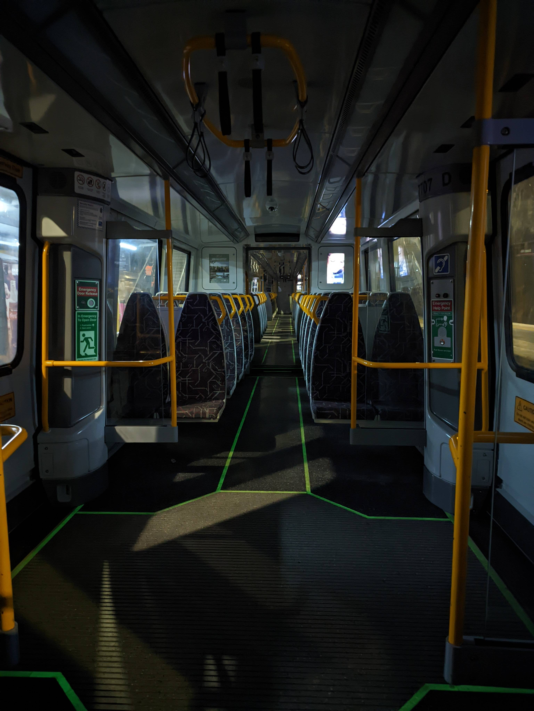

# NGR (New Generation Rollingstock)

## Some Observations about NGRs

### Uncomfortable Seats

The foam used in the NGRs' seats were required to meet the new (compared to the 160/260) EN fire standards in order to go through the CRR tunnels, which meant that in order to attain the fire performance required, the foam has graphite in it. While the 160/260 is going through overhaul, the fire standard for overhaul allows you to replace components with materials "no worse than" the original from a fire performance perspective.

The QTMP will have a higher requirement for comfort levels, and with new foam technologies they should be compliant to the code while still being comfortable.

Source: [https://www.reddit.com/r/BrisbaneTrains/comments/1gx246a/comment/lyh96dh](https://www.reddit.com/r/BrisbaneTrains/comments/1gx246a/comment/lyh96dh)

### Lack of NGRs on Ferny Grove / Beenleigh line

> So as far as I understand (and QR employees can correct me here) and as far as most people on transport forums understand the red line can’t run NGR’s because gaythorne station is so curved that the guard who has to positioned at the back on NGR’s can’t see all the way around the platform, since EMU’s SMU’s and IMU’s are 2 sets of 3 carriages the guard stands in the middle so can see both sides
>
> Now the QTMP’s are also supposed to be sets of 6 rather than sets of 3 so they will also have the same problems, alongside this the QTMP’s will decommission the EMU’s so there will be even fewer trains that can run on the red line and they will continue to get older and older.
>
> [https://www.reddit.com/r/BrisbaneTrains/comments/12sk45t/comment/jgz10hw](https://www.reddit.com/r/BrisbaneTrains/comments/12sk45t/comment/jgz10hw)
>
> NGRs are coming to Ferny Grove, I’m not privy to the exact date but they just added a raised section to Keperra and extended the end of the platforms. Its only a matter of time. Theres other stations that have a curve like Gaythorne and the cameras on the NGR work fine. i.e. Morningside outbound, guard cant see the front of the platform
>
> [https://www.reddit.com/r/BrisbaneTrains/comments/12sk45t/comment/jgzn96b](https://www.reddit.com/r/BrisbaneTrains/comments/12sk45t/comment/jgzn96b)

### NGRs are not permitted west of Ipswich

### Loud Brakes

> apparently it's shit brake pad material and because of it, brake calipers having to clamp down so hard in order to brake. I wouldn't be surprised that's another thing they'll have to fix on top of putting in a new toilet at Maryborough to comply with DDA
>
> Source: [https://www.reddit.com/r/brisbane/comments/czh61p/comment/eyyh6a0](https://www.reddit.com/r/brisbane/comments/czh61p/comment/eyyh6a0)

### Customers are reminded the exit buttons are located in the _middle_ of the door

u/EliraeTheBow on [Reddit](https://www.reddit.com/r/brisbane/comments/1b68fog/comment/ktd0uge):

> So the button announcement was brought in when the new trains were commenced ~10 years ago. The first week on the new trains, there was a lot of confusion because the buttons used to be on the left and right of the doors.
>
> I remember being stuck on a train about to leave central with a dozen people at peak hour staring bewilderedly at the walls around us trying to figure out how to open the doors, until some champion took pity on us, barged through and pressed the button in the middle.
>
> Shortly thereafter, the button announcements began.

## Gallery

> An NGR that stopped at Bowen Hills and had to do a full restart to fix something, taken around midnight.
>
> Source: [https://imgur.com/3oQMwy3](https://imgur.com/3oQMwy3), [u/beastjim](https://www.reddit.com/user/beastjim/) on [Reddit](https://www.reddit.com/r/brisbane/comments/11lmi2d/comment/jbe5u5w)
