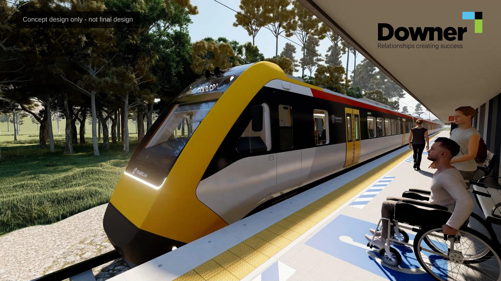
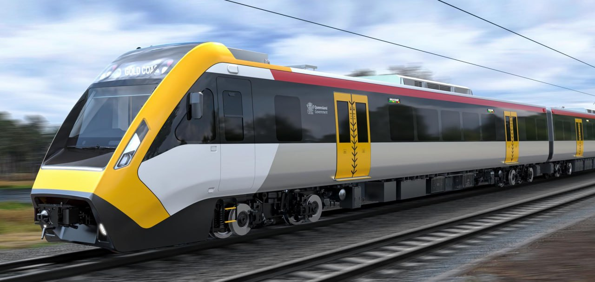

# QTMP / NNGR (Queensland Train Manufacturing Program / New NGR)

**This page is under construction!! Check out [QTMP on TMR's Website](https://www.tmr.qld.gov.au/projects/programs/queensland-train-manufacturing-program).**

The QTMP is a $9.5 billion program funded by the Queensland Government to design, build, and maintain 65 new trains for the SEQ network. The program also includes the construction of a purpose-built manufacturing faciltiy in the Fraser Coast region, as well as a new rail faciltiy in Ormeau for train maintenance and stabling.

> QTMP contract has an option for a further 10 but they cant guarantee they will be delivered before the Olympics, only the 65 already contracted.
>
> Source: [https://www.reddit.com/r/BrisbaneTrains/comments/1h74d2a/comment/m0iwxv1](https://www.reddit.com/r/BrisbaneTrains/comments/1h74d2a/comment/m0iwxv1)

> QTMP will have a "remote startup" capability that enables the train to start and reboot remotely including clearing any fault logs prior to the drivers arrival.
>
> Source: [https://www.reddit.com/r/BrisbaneTrains/comments/1hifhrg/comment/m2ymu2u](https://www.reddit.com/r/BrisbaneTrains/comments/1hifhrg/comment/m2ymu2u)

> QTMP trains will have a real-time passenger counting system
>
> See: [https://channellife.com.au/story/st-engineering-wins-contract-for-new-train-information-system-in-qld](https://channellife.com.au/story/st-engineering-wins-contract-for-new-train-information-system-in-qld)

QTMP trains will be "the most accessible trains in Australia", with leading technology including train boarding bridges and electronic levelling control to address the horizontal and vertical gaps between platforms and trains. This will allow people using mobility devices and wheelchairs the option to board independently at any door without assistance and use one of the 20 wheelchair allocated spaces located throughout the train\[1\].

## Timeline

- _October 2020_: Funding announced for a new fleet of trains.
- _June 2021_: Alstom, CAF and Downer announced as shortlisted applicants to deliver Queensland Train Manufacturing Program.
- _October 2021_: Torbanlea announced as the location of the train manufacturing facility.
- _April 2022_: Early works commenced for the manufacturing facility.
- _Mid-2022_: Shortlisted applicants submitted final proposals.
- _October 2022_: Ormeau announced as the location for the rail facility.
- _February 2023_: Announcement of Downer as the preferred applicant to deliver Queensland Train Manufacturing Program.
- _June 2023_: Downer awarded the contract to deliver the Queensland Train Manufacturing Program.
- _Late 2023_: Site construction works at the manufacturing and rail facilities started.

(Future dates: indicative only)

- _Late 2025_: Construction of the Torbanlea train manufacturing facility completed and train manufacturing begins.
- _Late 2026_: The first train is completed and begins testing.
- _Late 2026_: Ormeau rail facility construction completed.
- _Q2 2026_: QTMP Scheduled to enter service.
- _2032_: All trains expected to be in service.

## Gallery

## Sources

- **\[1\]** [https://documents.parliament.qld.gov.au/tableoffice/questionsanswers/2023/1232-2023.pdf](https://documents.parliament.qld.gov.au/tableoffice/questionsanswers/2023/1232-2023.pdf)
