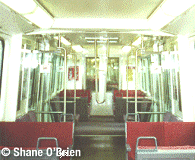
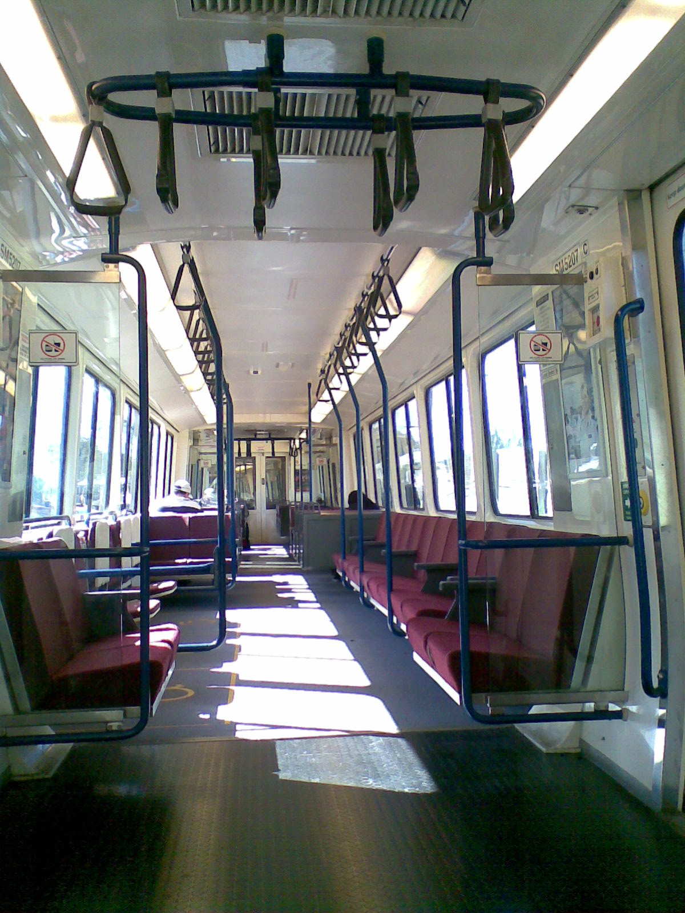

# SMU (Suburban Multiple Unit)

**This page is under construction!! Check out [SMU on Wikipedia](https://en.wikipedia.org/wiki/Suburban_multiple_unit).**

The SMUs are a class of units used by QR in SEQ, manufactured between 1994 and 2011. SMUs are divided into 3 subclasses, the SMU200, SMU220, and SMU260\[1\].

## Walkers/Adtranz Suburban Multiple Unit 200 series (SMU200)

> The SMU200 as seen on [QR's _Carriage Layouts_ page](https://www.queenslandrail.com.au/forcustomers/accessibility/carriage-layouts)

The 12 SMU200s were introduced in 1994 due to a shortage in rollingstock caused by an increase in demand\[1\], as well as to offset the loco-hauled SX Set run services that were slowly being phased out for health and safety reasons\[2\]. The trains, numbered SMU201-212, entered service on the 16th of August 1994 and were the first new trains since EMU deliveries ended in 1989\[1\].

The units used modern GTO (gate turn-off) thyristor traction control systems\[8\] (EMUs also used thyristor TCS's), with the units set up similar to the EMUs with a Driver-Motor, Motor, and Driver Trailer cars. They use blower for cooling both the traction equipment and braking grids, and although the EMUs are quite louder with their high-pitch traction motors, the SMU200s (and IMU100s) are known to be quite loud on take-off due to their blowers winding up. Although when running they are very quiet and have the typical gear switching sound of a thyristor control system\[2\].

Train drivers also have access to full computerized information about the performance of the train\[8\].

The SMU200s are commonly mixed with SMU220 class to make up 6-car trains, however as they use the Scharfenburg coupler they can be coupled to EMUs, IMUs, ICE sets, and Tilt Trains for haulage purposes only as they are not 100% electrically compatible\[2\].

The SMU200s were fitted with the Digital Voice Announcement System, which inform the passengers of the route and next station over the Public Address system, from their manufacturing, while the EMUs were only fitted with it later\[4\]. They also featured new Passenger Emergency Intercoms, which were also added to the EMUs later\[8\].

### Specs

| Spec                          | Value                                                                                                                                                     |
| ----------------------------- | --------------------------------------------------------------------------------------------------------------------------------------------------------- |
| Manufacturer                  | Walkers Ltd. Maryborough/ABB Transportation, Switzerland\[4\]                                                                                  |
| Gauge                         | Narrow Gauge (1,067mm or 3' 6")\[4\]                                                                                                           |
| Length when Coupled           | 72,422mm\[4\]                                                                                                                                  |
| Bogie Centres                 | 17,000mm\[4\]                                                                                                                                  |
| Bogie Wheelbase               | 2,500mm\[4\]                                                                                                                                   |
| Wheel Diameter                | 840mm\[4\]                                                                                                                                     |
| Width                         | 2,720mm\[4\]                                                                                                                                   |
| Height over Roofline          | 3,872mm\[4\]                                                                                                                                   |
| Height of Floor               | 1,100mm\[4\]                                                                                                                                   |
| Road numbers                  | DM5201–12, M6201–12, DT8201–12\[3\]                                                                                                            |
| Maximum speed                 | 100km/h\[1\]                                                                                                                                   |
| Traction Rating               | 8 x 180 kW\[4\]                                                                                                                                |
| Maximum Acceleration          | .8m/s2 \[4\]                                                                                                                        |
| Maximum Service Brake         | 1.15m/s2 \[4\]                                                                                                                      |
| Weight                        | 45,020 kg (DM / driving motor car); 46,130 kg (M / non-driving motor car); 35,020 kg (DT / driving trailer car)\[4\]                           |
| Length                        | 23.5 m (DM / driving motor car, DT); 23.1 (M / non-driving motor car)\[3\]                                                                     |
| Seats                         | 76 (DM / driving motor car, DT / driving trailer car); 88 (M / non-driving motor car)\[3\]                                                     |
| Total Service Capacity (3car) | 500\[6\]                                                                                                                                       |
| Traction System               | ABB MICAS-S2 GTO-VVVF\[1\]                                                                                                                     |
| Traction Motor Control        | One GTO Thyristor converter per 8 asynchronous AC traction motors using three phase variable voltage/variable frequency (VVVF) technology\[4\] |
| Transmission                  | Bogie suspended traction motor through cardan shaft to right angle axle gear drive unit\[4\]                                                   |
| Gear Ratio                    | 1:5.169\[4\]                                                                                                                                   |
| Braking System                | Regenerative electric and electropneumatic thread brake\[4\]                                                                                   |
| Auxiliary System              | 2 x 100 kVA three phase static converters\[4\]                                                                                                 |
| Climate Control               | 2 x roof mounted air conditioners per car each with 30 kW cooling capacity\[4\]                                                                |

### Timeline

- _August 16, 1994_: First SMU200 entered service\[1\].
- _2017_: IMU100s and SMU200s underwent an overhaul, including an upgrade of the traction package and Train Control Managment System on 10 IMU100s and 12 SMU200s, and one of the pneumatic cab doors of an IMU100 got upgraded. This work was done by Downer EDI Rail for $105,430,828\[10\].
- _December 2018_: Downer awarded an $80 million contract to overhaul the IMU100s and SMU200s to be completed at Downer’s Maryborough Service Delivery Centre\[5\], including:
  > - Interior refresh – new floor coverings, refreshed handrails and grab handles and new seat foams and covers for enhanced customer experience
  > - Overhaul of key train subsystems to ensure the safety and reliability of the fleet
  > - New electrical systems (in partnership with ABB), including upgrade of onboard traction equipment and installation of a new Train Control Management System (TCMS).
- _January 17, 2020_: QR paid out $2.6 million to CoachAir for `"2019 IMU100 SMU200 HVAC Overhaul"`, possibly as part of Downer's refurbishment that started Dec 2018\[11\].
- _2023_: QR replaced the routers in EMUs, IMU100s, SMU200s, IMU120s, and SMU220s. The work was contracted out to Nomad Digital and cost $1.75 million\[11\].
- _2023_: Downer's SMU200 overhaul completed\[5\].
- _December 5, 2023_: Noske-Kaeser New Zealand awarded a contract to complete 10 Year Overhauls on IMU100s and SMU200s, including these replacements\[7\]:
  > - Compressors and various refrigeration components
  > - The PLC and switching gear
  > - Safety devices such as pressure transducers and heaters overtemperature switches
  > - Heaters, fans, insulation on covers
  > - \[add new?\] Circuit breakers to address obsolescence of existing breakers and compliance with MD-10-125
- _2036_: SMU200s anticipated to commence retirement (as of August 2021)\[9\].

### Carriage Layout (Design A)

#### Carriage 1

#### Carriage 2

#### Carriage 3

### Carriage Layout (Design B)

May also be SMU220, but I can't tell the difference.

[Source](https://railknowledgebank.com/Presto/content/GetDoc.axd?ctID=MTk4MTRjNDUtNWQ0My00OTBmLTllYWUtZWFjM2U2OTE0ZDY3&rID=OTY2&pID=Nzkx&attchmnt=True&uSesDM=False&rIdx=MTg1Mw==&rCFU=) archived [here](../media/Archive/Andrew%20Whitten.pdf) - see figure A1

#### Carriage 1

[View full image](../media/Layouts/SMU200_DesignB_1.png)

#### Carriage 2

[View full image](../media/Layouts/SMU200_DesignB_2.png)

#### Carriage 3

[View full image](../media/Layouts/SMU200_DesignB_3.png)

## EDI/Bombardier Suburban Multiple Unit 220 series (SMU220)

> The SMU220 as seen on [QR's _Carriage Layouts_ page](https://www.queenslandrail.com.au/forcustomers/accessibility/carriage-layouts)

To keep the auxiliary converters (and systems) online through neutral sections 220’s and 120’s automatically apply a small amount of regenerative braking when traversing neutral sections at speeds above 20km/h. This reduces the need to rely on the battery system and is why they maintain full lighting and air conditioning compared to other units in the fleet.

For some reason at speeds around 40-60km/h they can produce a rather nasty shudder through the train. As a driver there isn’t much that can be done to prevent it. Some do it, some don’t, some are worse than others. Just a quirk of the units.
Source: [https://www.reddit.com/r/BrisbaneTrains/comments/1hikjzi/comment/m321aky](https://www.reddit.com/r/BrisbaneTrains/comments/1hikjzi/comment/m321aky)

SMU222, along with another unit, is usually used for driver training.

Source: [https://www.reddit.com/r/brisbane/comments/k0hqc3/comment/gdijsfo](https://www.reddit.com/r/brisbane/comments/k0hqc3/comment/gdijsfo)

### Timeline

- _2038_: SMU220s anticipated to commence retirement (as of August 2021)\[9\].

### Carriage Layout

#### Carriage 1

#### Carriage 2

#### Carriage 3

## EDI/Bombardier Suburban Multiple Unit 260 series (SMU260)

> The SMU260 as seen on [QR's _Carriage Layouts_ page](https://www.queenslandrail.com.au/forcustomers/accessibility/carriage-layouts)

### Timeline

- _2050_: SMU260s anticipated to commence retirement (as of August 2021)\[9\].

### Carriage Layout

#### Carriage 1

#### Carriage 2

#### Carriage 3

### Gallery

> [View full image](../media/SMU200_Interior_1.png)
>
> The original interior of an SMU200. Copyright Shane O'Brien. Seen on: [QROTI - Travel Information - Fleet - SMU](https://web.archive.org/web/20080720231805/http://qroti.com/travelinfo/qr/fleet/smu/) (archived from [the original](http://qroti.com/travelinfo/qr/fleet/smu/)).

> [View full image](../media/SMU200_Interior_2.jpg)
>
> The interior of a Queensland Rail SMU 200 series unit. Taken May 18, 2008 by Ash Kyd. This was the old style, before QR refurbished them. [Source](https://www.flickr.com/photos/ashkyd/2501756494/).

There may also be other photos in the [Gallery](../Gallery/My-Photos.md)

## Sources

- **\[1\]** [https://en.wikipedia.org/wiki/Suburban_multiple_unit](https://en.wikipedia.org/wiki/Suburban_multiple_unit)
- **\[2\]** [https://qrig.org/motive-power/self-propelled-passenger-stock/electric-multiple-units/walkersadtranz-suburban-multiple-unit-200-series-smu200](https://qrig.org/motive-power/self-propelled-passenger-stock/electric-multiple-units/walkersadtranz-suburban-multiple-unit-200-series-smu200)
- **\[3\]** [https://www.railtram.com.au/smu-suburban-multiple-unit-200](https://www.railtram.com.au/smu-suburban-multiple-unit-200)
- **\[4\]** [http://www.railpage.org.au/qrhistory/html/locomotives/electrics/smu.htm](http://www.railpage.org.au/qrhistory/html/locomotives/electrics/smu.htm)
- **\[5\]** [https://www.downergroup.com/downer-secures-80-million-queensland-rail-con](https://www.downergroup.com/downer-secures-80-million-queensland-rail-con)
- **\[6\]** [https://queensland-trains.fandom.com/wiki/SEQ_Network_Fleet](https://queensland-trains.fandom.com/wiki/SEQ_Network_Fleet)
- **\[7\]** [https://qtenders.epw.qld.gov.au/qtenders/contract/view.do?CSRFNONCE=376F38EAD88F3EB9E36E5CC47D8CB634&tenderId=48267](https://qtenders.epw.qld.gov.au/qtenders/contract/view.do?CSRFNONCE=376F38EAD88F3EB9E36E5CC47D8CB634&tenderId=48267)
- **\[8\]** [QROTI - Travel Information - Fleet - SMU](https://web.archive.org/web/20080720231805/http://qroti.com/travelinfo/qr/fleet/smu/) archived from [the original](http://qroti.com/travelinfo/qr/fleet/smu/).
- **\[9\]** Question on Notice No. 913 - August 31 2021: [https://documents.parliament.qld.gov.au/tableoffice/questionsanswers/2021/913-2021.pdf](https://documents.parliament.qld.gov.au/tableoffice/questionsanswers/2021/913-2021.pdf) archived [here](../media/Archive/913-2021.pdf)
- **\[10\]** [https://www.data.qld.gov.au/dataset/queensland-rail-contract-disclosure-fy2022-2023/resource/d135ec7d-4a7a-40b2-98e4-3df90365f374](https://www.data.qld.gov.au/dataset/queensland-rail-contract-disclosure-fy2022-2023/resource/d135ec7d-4a7a-40b2-98e4-3df90365f374) archived [here](../media/Archive/qr-contract-disclosure-fy2022-2023.csv)
- **\[11\]** [https://www.data.qld.gov.au/dataset/queensland-rail-contract-disclosure-fy2023-2024/resource/22563422-0ea2-4bb0-80fb-a0428afc6365](https://www.data.qld.gov.au/dataset/queensland-rail-contract-disclosure-fy2023-2024/resource/22563422-0ea2-4bb0-80fb-a0428afc6365) archived [here](../media/Archive/qr-contract-disclosure-fy2023-2024.csv)