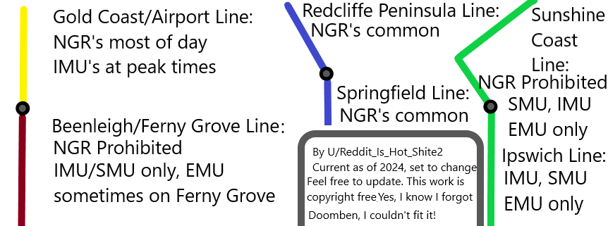

# Best Lines to See Different Models

## Image Summary

> Source: [https://www.reddit.com/r/BrisbaneTrains/comments/1g6abiw/train_enjoyers_guide_to_train_models_and_how_to/](https://www.reddit.com/r/BrisbaneTrains/comments/1g6abiw/train_enjoyers_guide_to_train_models_and_how_to/)

## Gold Coast / Airport line

NGRs most of the day, with IMUs at peak times. You may get like 3 IMUs a day, so not exactly common and most probably no EMUs.

## Beenleigh / Ferny Grove

The NGR trains are not able to run on the Ferny Grove line at all, as they leave a large gap between the train and platform at some stations, meaning passengers cannot board safely and, at Newmarket and Keperra, the platforms are too short to accommodate the NGR trains at all. Due to these issues—and the pairing of the Ferny Grove and Beenleigh lines—it means the NGR trains also do not run on the Beenleigh line as part of the regular timetable\[1\]. Thus, mostly IMUs / SMUs will appear on the line, with EMUs sometimes on Ferny Grove.

## Redcliffe Peninsula / Springfield Line:

NGRs are common on the Redcliffe Peninsula / Springfield Line because of the large amount of stabling at Kippa Ring, as well as at Wulkuraka/Redbank. However, there are rarely EMUs on it when it's not an NGR.

## Rosewood

On the Rosewood line, the NGR trains are too long for the platform, forcing passengers into the front three cars, otherwise they would step and fall onto the tracks\[1\]. Therefore, there is mostly IMUs, SMUs, and EMUs on the Rosewood line.

## Ipswich / Caboolture / Nambour

Mainly SMUs and IMUs but some NGRs.

## Gympie North

NGRs are now allowed on the Gympie North line.

<s>NGRs will not operate on Sunshine Coast line services north of Nambour until signalling upgrades to Gympie North have been completed. Currently trains are required to be compatible with the operation of Automatic Train Protection which isn't fitted on the NGRs. (Information may be outdated).</s>

<s>The Gympie North line generally features IMU100's/120's due to the ATP requirement.</s>

[https://www.reddit.com/r/brisbane/comments/17v0tsi/comment/k98p2kb/](https://www.reddit.com/r/brisbane/comments/17v0tsi/comment/k98p2kb/)

> Correct, need a forward facing observer seat in the driving cab for a second driver which the 160/260s don’t have and <s>ngrs cant work past nambour yet.</s>

> There's this thing called route competency, and only Gympie North, some Nambour, some Caboolture and some Mayne (Bowen Hills) depot crew are qualified for. There are some crew at Mayne who can't work north of Northgate, or south of Yeerongpilly/Corinda. And there's a bit of a clique with old timers who want to keep their "rare" route competency for themselves, and there's a big thing with seniority of service to learn extra routes such as Nambour and Gympie North.

## Cleveland / Shorncliffe

The Cleveland / Shorncliffe line has the second least amount of NGRs on it, after Beenleigh / Ferny Grove, most likely due to stabling reasons. However, it is still mostly NGRs.

## Post CRR

NGR, along with upgraded SMU 260 trains, will be the only trains permitted to travel in the Cross River Rail tunnels.

## Sources

- **\[1\]** [https://documents.parliament.qld.gov.au/tableOffice/questionsAnswers/2024/868-2024.pdf](https://documents.parliament.qld.gov.au/tableOffice/questionsAnswers/2024/868-2024.pdf)
